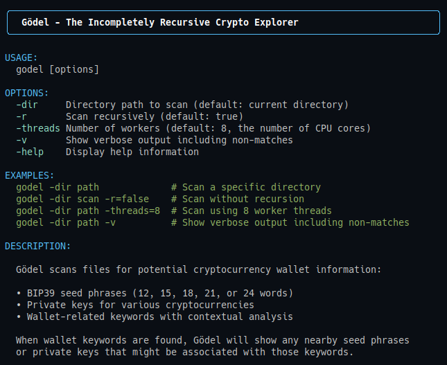

# Gödel - The Crypto Seed Phrase Recovery Tool


## Recover Your Keys. Recover Your Coins.

Gödel is designed to help users recover lost cryptocurrency wallet seed phrases and private keys. This Go-based tool scans files and directories on your local filesystem, external drives, and supported cloud storage (Dropbox, Google Drive) to locate and verify potential wallet recovery information.

---

## **What Does It Do?**

Gödel searches for:

- **BIP39 Seed Phrases**: Typically 12-24 words used by cryptocurrency wallets.
- **Private Keys**: For major cryptocurrencies such as Bitcoin, Ethereum, Solana, etc.
- **Wallet-related Information and Keywords**.

---

## **Screenshot**



---

## **Key Features**

- **Deep File Scanning with Recursive Directory Support**: Ensures no potential recovery information is overlooked.
- **Handles Common File Formats**: Includes `.txt`, `.md`, `.doc`, `.rtf`, and others.
- **BIP39 Seed Phrase Validation**: Confirms the validity of found seed phrases.
- **Private Key Detection and Verification**: Identifies private keys with cryptographic validation.
- **Smart Context Matching**: Reduces false positives by analyzing the context of matches.
- **Probability Scoring for Match Confidence**: Provides a confidence level for each match.

---

## **Quick Start**

```bash
# Basic help
./bin/godel

# Help with all options
./bin/godel -help

# Scan a directory
./bin/godel -dir /path/to/scan

# Scan a single directory without recursion
./bin/godel -dir /path/to/scan -r=false
```

### **Reading the Results**

Each match includes:

```md
Match #4: Type: Wallet Keyword
Content: Seed Phrase
Line: 5
Associated Keys: - Seed Phrase: abandon ability able about above absent absorb abstract absurd abuse access accident
```

**Results Show:**

- **Match type**: Seed Phrase, Private Key, or Wallet Keyword.
- **Found content**.
- **Line location** within the scanned file.
- **Related keys found nearby** (within 5 lines).

---

## **Installation**

```bash
# Clone the repository
git clone https://github.com/HunterR0se/godel.git

# Navigate to the directory
cd godel

# Build the tool
go build -o bin/godel

# Run the tool
./bin/godel

# Alternatively, use the script
./build.sh
```

## **Contributing**

Contributions to Gödel are welcome! Please feel free to submit a Pull Request.

1. Fork the repository
2. Create your feature branch (`git checkout -b feature/amazing-feature`)
3. Commit your changes (`git commit -m 'Add some amazing feature'`)
4. Push to the branch (`git push origin feature/amazing-feature`)
5. Open a Pull Request

---

## **Code Structure**

```md
Gödel/
├── bin/ # Compiled binaries
├── internal/ # Application-specific internal packages
│ ├── cli/ # Command-line interface functionality
│ ├── scanner/ # Core file scanning and processing logic
│ └── wallet/ # Wallet derivation and validation utilities
├── pkg/ # Reusable packages
│ ├── crypto/ # Cryptographic utilities for validating wallets
│ ├── fileutil/ # File scanning and reading utilities
│ ├── matcher/ # Pattern matching logic
│ ├── patterns/ # Pattern definitions and word lists
│ └── ui/ # User interface and display formatting
├── test_samples/ # Sample files for testing
├── build.sh # Build script
├── main.go # Application entry point
├── README.md # Project documentation
└── TODO.md # Project roadmap
```

---

## **License**

MIT

---

## **Important Notes**

This tool is intended solely for recovering your own wallet information. Use it responsibly and respect data privacy.

---

## **Security Best Practices**

When scanning for sensitive credentials:

- **Handle seed phrases and private keys with extreme care**.
- **Store results securely**.
- **Use isolated or encrypted systems when possible**.
